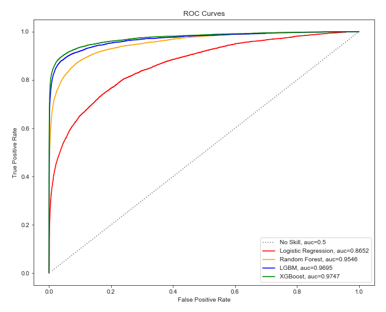

## Motivation

Fraud risk is everywhere. One major sector affected by fraud risk is the e-commerce industry. Online payment service companies are able to collect a vast amount of data on individuals and their transactions and use modeling to distinguish between fraudulent and non-fraudulent behaviors. In order to build our modeling skills and explore the field of fraud detection, we are applying machine learning to detect online payment frauds in a e-commerce transaction dataset from IEEE Computational Intelligence Society (IEEE-CIS) and payment service company, Vesta Corporation.

## Data & Preprocessing

The [dataset](https://www.kaggle.com/c/ieee-fraud-detection/data) provided by Vesta includes identification and transaction data on a series of online payments. The data contains the following unmasked features.

Table 1A: Unmasked Features

| Feature Name  | Description 
| ------------- | ------------- 
| TransactionDT | timedelta from a given reference datetime
| TransactionAMT | transaction payment amount in USD
| ProductCD | product code for each transaction
| addr | address of purchaser
| P_emaildomain | purchaser's email
| R_recipientdomain | recipient's email
| DeviceType | desktop or mobile
| DeviceInfo | specific machine (e.g. MacBook)

The meaning of the following features are masked but Vesta has provided the following high level descriptions about the feature categories. Note the examples below are for illustrative purposes only and these specific features may not exist in the data.

Table 1B: Masked Features

| Feature Category  | Description 
| ------------------- | ------------- 
| id12 - id38| identies, such as network connection, digital signature, etc.
| card1 - card6 | payment card information, such as card type, card category, issue bank, etc.
| dist | distance between 2 masked locations
| C1-C14 | counting, such as how many addresses are found to be associated with the payment card, etc.
| D1-D15 | timedelta, such as days between previous transaction, etc.
| M1-M9 | match, such as names on card and address, etc.
| Vxxx | Vesta engineered rich features, including ranking, counting, and other entity relations

**Missing Data**

All except 20 features have some missing values. We drop features where 90-100% of the values are missing. Since our dataset is so large and most of our features are masked, we decide to not pursue any complex data imputation techniques. For models that can't handle missing values such as logisitic regression, we fill NAs with 0. For models that can handle missing values such as XGBoost, we experiment with leaving missing values as is and filling missing values with -999. -999 is well outside the range of typical values and we believe that the model will be able to distinguish these values as missing and ignore them. 

**Multicollinearity**

Many of our features are derived from each other so our predictors are highly multicollinear. Because we want to extract feature importance from our models, we need to reduce multicollinearity. Since the Vxxx features are engineered features and not actual data, we drop one of every two highly correlated features (e.g. correlation > 0.75 or correlation < -0.75). We drop the feature with fewer number of unqiue values, the intuition being that the feature with greater number of unqiue values contains more "granular" data. 

Although non-Vxxx features (features that are not the Vxxx features) are also multicolinear, we are slightly hesitant to drop them. The non-Vxxx features represent actual data that might be useful in distinguishing between fraud and not fraud. We experiment with two versions of the data, one with all non-Vxxx columns included and another with multicollinear non-Vxxx columns dropped.

Figure 1: C features correlation matrix


**Feature Engineering**

Our dataset is at the transaction level and our models try to find patterns that distinguish fraudulent behavior from normal behavior. However, fraudulent behavior might differ for each user and one user's fradulent behavior may be another user's normal behavior. We want to identify a unique user id and see how rare or common a transaction is for that specific user. Adding features that represent user level statistics (i.e. mean, standard deviation) can help our model find those patterns. This method of feature engineering is common in LGBMs (Light Gradient Boosting Machine) and is discussed in detail by [Chris Deotte](https://www.kaggle.com/c/ieee-fraud-detection/discussion/108575#latest-641841). 

The dataset does not provide a unique user id, so we identify 3 possible combinations of features that could be unqiue to each user: [[card1], [card1 and addr1], [card1, addr1 and P_emaildomain]]. Then for each possible unique id, we add user level mean and standard deviation for TransactionAmt, D9, and D11. Our engineered features closely resemble the strategy detailed by [Konstantin Yakovlev](https://www.kaggle.com/kyakovlev/ieee-fe-with-some-eda).

After addressing missing values, multicolinearity, and feature engineering we have the following datasets:

|        | keeping all non-Vxxx features  | dropping multicollinear non-Vxxx features
| ------ | ------------------- | ------------- 
| **keeping NA values** | X1 | X2
| **filling NA values** | X3 | X4

## Methodology (Ngan, Wendy)

### Hyperparamter Tuning and Model Selection
In this project, we evaluated different classification models to label fraudulent transactions. In order to prevent data leakage and optimistic estimates of model performance, we implemented nested cross-validation (CV). Nested CV consits of 2 nested loops in which the inner loop is used to find the best set of hyperparameters for each candidate model and the outer loop is used to select the best model [1](https://www.oreilly.com/library/view/evaluating-machine-learning/9781492048756/ch04.html). Due to the complexity, computational power and financial limitation, we decided to perform hold-out sample approach instead of cross-validation. Some preliminary analysis on the data showed that hold-out sample approach sufficiently captured the generality of the data (appendix??). 

Figure X shows the detailed nested validation approach. In the outer loop, training data was divided randomly into dataset A and B. Dataset B was hold out for model selection while dataset A entered the inner loop for parameter tuning. Parameter tuning was performed independently for each model. Dataset A was partitioned randomly into dataset C and D. Different sets of hyperparameters were applied on dataset C and evaluated on dataset D. The inner loop outputed the best hyperparameter setting for the model. The next step was to train a new model on the entire dataset A under the best hyperparameter setting. This model was then applied on the holdout dataset B to obtain validation performance. Comparison of different models with their best hyperparameter settings on holdout dataset B yielded the best model. Once again, the final best model was trained using all training data available (A&B) under its best hyperparamter setting. Results of classifying testing data using the final best model was submitted on Kaggle.

Figure X. Nested Validation Methodology Diagram


### Parameter Optimization

- Paramter Tuning using Bayes Search Optimization (Wendy)

### Model Performance Metrics
Fraud detection is a highly imbalanced classification problem in which amount of non-fraudulent data outnumbered one of fraudulent data. In this project, area under receiving operating characteristic curve (AUC-ROC score) was used to evaluate model performance. Higher AUC indicates better model at distinguishing between fraud and non-fraud transactions.

## Experiments (Ngan,Uma,Aditi,Wendy)

### Approach 1: Regression Methods
We began our modeling with a simple logisitic regression model which would serve as our baseline as we explored more complex methods.

### Dealing with class imbalance


Before fitting any model, we wanted to ensure we are feeding the model a balanced dataset. Our dataset constituted of 3.5% fraudulent transactions and the rest were non-Fraud. Many machine learning algorithms are designed to operate on classification data with an equal number of observations for each class. When this is not the case, algorithms can learn that very few examples are not important and can be ignored in order to achieve good performance.

Data sampling provides a collection of techniques that transform a training dataset in order to balance or better balance the class distribution. Once balanced, standard machine learning algorithms can be trained directly on the transformed dataset without any modification. This allows the challenge of imbalanced classification, even with severely imbalanced class distributions, to be addressed with a data preparation method.

There are 2 ways to handle this:

1. Over sampling : Duplication or replication of examples from minority class
2. Under sampling : Restrained choosing of examples from the majority class

Random oversampling increases the likelihood of overfitting for the minority class as we end up making exact repplications of minority class examples.
Oversampling can also bring in bias into the system because it gets restrained in the examples taught to it lessening its ability to generalize to a standard dataset.

Hence we decided to perform undersampling. There are different ways to perform undersampling:

### Random undersampling:

This involves randomly selecting examples from the majority class to delete from the training dataset. This has the effect of reducing the number of examples in the majority class in the transformed version of the training dataset. This process can be repeated until we have equal number of examples for each class. 

We implemented this technique by randomly selecting data points in the non-Fraud class using the RandomUndersampler from imbalanced-learn class. The number of data points selected was equal to the number of data points in the fraud class feeding a balanced distribution to the classifier.


### Clustered undersampling [K Medoids]
This involves performing clustering on the majority class. Specifically, the number of clusters in the majority class is set to be equal to the number of data points in the minority class. The cluster centers are then used to represent the majority class. 

Due to the high number of dimensions, direct clustering was proving to be computationally very intensive. Hence we first performed inferential feature selection. 

#### Feature selection (Chi squared/ANOVA tests)
Inferential feature selection aims to select variables which are highly dependent on the response variable.

In our case, our response variable is categorical. Numeric and categorical variables must be handled differently due to difference in the type of distributions.

___CHI-SQUARED TEST___

For categorical variables, we performed Chi squared test. A chi-square test is used in statistics to test the independence of two events. Given the data of two variables, we can get observed count O and expected count E. 
Chi-Square measures how expected count E and observed count O deviates each other.


When two features are independent, the observed count is close to the expected count, thus we will have smaller Chi-Square value. So high Chi-Square value indicates that the hypothesis of independence is incorrect.  
Hence, higher the Chi-Square value the feature is more dependent on the response and it can be selected for model training.

We chose variables until there is a sudden dip in the chi-squared scores.


___ANOVA TEST___

Analysis of Variance is a statistical method, used to check the means of two or more groups that are significantly different from each other. It uses the F distribution to test the same.
It assumes Hypothesis as
H0: The 2 means are equal
H1: At least one mean of the groups are different.

The fscore gives us an idea if there is a variance between the 2 groups of fraud and non fraud explained by that particular numeric variable. A higher F-score indicates the variable is important.

We chose variables until there is a sudden dip in the F score.


We then implemented the clustering using KMediods.

#### Clustering by K Medoids

The K-means clustering algorithm is sensitive to outliers, because a mean is easily influenced by extreme values. K-medoids clustering is a variant of K-means that is more robust to noises and outliers. Instead of using the mean point as the center of a cluster, K-medoids uses an actual point in the cluster to represent it. Medoid is the most centrally located object of the cluster, with minimum sum of distances to other points. 
 


**Result**
The dataset that was undersampled using clustering gave a much better ROC-AUC value. However, we could perform this test only on a portion of the dataset as we did not have enough computational resources to cluster the entire dataset of 590,940 and 1303 columns.
From the models described below, only Logistic Regression needs data that is balanced. Other models account for the imbalance within themselves. 

**Logistic Regression (Uma)**

Logistic regression is named for the function used at the core of the method, the logistic function. The logistic function is an S-shaped curve that can take any real-valued number and map it into a value between 0 and 1, but never exactly at those limits.


Logistic regression is a linear method, but the predictions are transformed using the logistic function. The model can be stated as:

p(X) = e^(b0 + b1X) / (1 + e^(b0 + b1X))

which then can be written as:


Thus the odds can be expressed as a linear combination of the predictor variables. Logistic regression models the probability of the default class, here the probability of fraud.

Table X: Listing of Logistic Regression hyperparameters tuned

| Hyperparameters  | Impact on model | Tuned value |
| ------------- | ------------- | ------------- |
| C | Inverse of regularization strength; must be a positive float. Like in support vector machines, smaller values specify stronger regularization| 10|
| max_iter | Maximum number of iterations taken for the solvers to converge | 17004|
| penalty | Used to specify the norm used in the penalization. Performs shrinkage of coefficients | l2 |
| solver | Algorithm to use in the optimization problem | 'saga'|


### Approach 2: Tree Based Methods
Compared to logisitic regression, tree based methods are less susceptible to outliers and make fewer assumptions about the underlying structure of our data. So, in addition to logisitic regression, we tried tree based methods such as Random Forest, LGBM, and XGBoost. 

**Random Forest (Ngan)**

The most basic tree based model is Decision Tree - a single tree algorithm which is commonly refered as Classification and Regression Trees (CART). A Decision tree is a flowchart like tree structure, in which each internal node denotes a test on an attribute, each branch represents an outcome of the test, and each leaf node (terminal node) represents a class label. The paths from root to leaf represent classification rules. Decision at each node is made such that it maximizes the information gain or minimizes the total entropy. The decision tree is susceptible to overfitting and hence requires pruning. However, pruned decision tree is still sentitive to high variance and instability in predicting test data. To resolve this issue, bagging decision tree model is introduced where it combines multiple decision trees. 

Random forest is identical to bagging decision tree except it adds additional randomness to the model. While splitting a node, instead of searching for the most important feature among all features, it searches for the best feature among a random subset of features. Therefore, in random forest, only a random subset of the features is taken into consideration by the algorithm for splitting a node. This results in a wide diversity that generally results in a better model.

In this project, we implemented random forest using the sklearn library "RandomForestClassifier" function. Although there are many hyperparameters that can be tuned in random forest, for the interest of time, we only focused on the main ones what can affect model performance significantly. See Table X.

Table X: Listing of Random Forest hyperparameters tuned

| Hyperparameters  | Impact on model | Tuned value |
| ------------- | ------------- | ------------- |
| n_estimators | Number of decision trees in the model. Higher value increases complexity of the model, making the model more likely to overfit.| 931|
| max_depth | Maximum depth of each decision tree. Higher value increases complexity of the model, making the model more likely to overfit. | 32|
| max_features | The number of features to consider when looking for the best split. Lower value means that each tree can only consider a smaller proportion of total features. This adds randomness to the model and avoids some columns to take too much credit for the prediction. | log2(n_features)|
| class_weight | Weights associated with classes in the form {class_label: weight}. By default, all classes have the same weight regardless of their count. The 'balanced' mode uses the values of y to automatically adjust weights inversely proportional to class frequencies in the input data as n_samples / (n_classes * np.bincount(y)). | 'balanced'|

- Results for XG_LR X_1, X_2:

Random Forest was implemented on both X_1 and X_2 dataset. Refer to Data & Preprocessing Section for more details on different dataset. We observed that random forest's performance on X_1 slightly outperformed that on X_2 dataset with AUC-ROC score of 0.955 compared to 0.947. This is expected as X_1 has more features than X_2, resulting in higher predictive power. 

Regarding to feature importance, both dataset showed relatively similar results. Although the relative order changed sligtly, the same features showed high importance such as "D1", "C13", "TransactionAMT_car1_addr1_mean", "C1", "D15", etc. 

In conclusion, we proceeded with X_1 features due to its higher performance in AUC-ROC score. 
 
**LGBM (Aditi)**

- maybe mention sth about "Gradient-based One-Side Sampling (GOSS) to filter out the data instances for finding a split value"
- Results for LGBM X_1, X_2, X_3, X_4

**XGBoost (Wendy)**

XGBoost is a gradient boosted decision tree algorithm designed for speed and performance, that is known exceptional performance in binary classification problems with a severe class imbalance. Our XGBoost model implementation used a histogram-based algorithm to compute the best split.

To accelerate our model training and hyperparameters tuning processes, we set up an AWS EC2 instance with GPU to train the XGBoost model on the cloud. Taking our base model as an example, this successfully decreases the training time from 58 minutes to under 3 minutes (95% decrease), and the prediction time from 2 minutes to under 8 seconds(93% decrease).

It is computationally and financially expensive to tune the hyperparameters of the XGBoost estimator. We have to priortize the parameters to be tuned (Table X) and outline a resonable search space. We also used the Bayesian optimization algorithm in the Scikit-optimize module for model tuning. After each iteration, the algorithm makes an educated guess on which set of hyperparameters is most likely to improve model performance. Therefore, this method is likely to be more efficient than other more commonly known methods, like GridSearch or random serach.

Table X. Ranked listing of XGBoost hyperparameters tuned

| Hyperparameters  | Impact on model | Importance |
| ------------- | ------------- |------------- |
| n_estimators | Number of decision trees in the model. Higher value increases complexity of the model, making the model more likely to overfit.| High|
|learning_rate| Impacts the duration needed for the model to converge and performance of the model. | High|
|max_depth| Maximum depth of each decision tree. Higher value increases complexity of the model, making the model more likely to overfit. | High|
|colsample_bytree| Number of features used by each tree. Lower value means that each tree can only consider a smaller proprtion of total columns. This avoids some columns to take too much credit for the prediction. | High|
|subsample| % of training set to subsample to build each tree. Higher value prevents overfitting, but potentially in sacrifice of performance. | Medium|
|gamma| Minimum reduction in the loss function required to make a split. Regularization parameter. Values can vary based on the loss function.| Medium|

- Results for XGBoost X_1, X_2, XG_LR X_1, X_2

### Results & Discussion 




Discuss results of you experiments and which one we ended up selecting, final test AUC from Kaggle? (Wendy)

Discuss how Vesta could operationalize this, things to consider from Uma's findings (Uma)

### References
https://www.oreilly.com/library/view/evaluating-machine-learning/9781492048756/ch04.html
https://www.kaggle.com/c/ieee-fraud-detection/data
https://www.kaggle.com/c/ieee-fraud-detection/discussion/108575#latest-641841
https://www.kaggle.com/kyakovlev/ieee-fe-with-some-eda


# Template info below incase you guys need it (Will not be in final report)

## Yo guys we will put our final results here!!!!

```markdown
Syntax highlighted code block

# Header 1
## Header 2
### Header 3

- Bulleted
- List

1. Numbered
2. List

**Bold** and _Italic_ and `Code` text

[Link](url) and 

```


For more details see [GitHub Flavored Markdown](https://guides.github.com/features/mastering-markdown/).

### Jekyll Themes

Your Pages site will use the layout and styles from the Jekyll theme you have selected in your [repository settings](https://github.com/umasreeram/fraud-detection-page.github.io/settings). The name of this theme is saved in the Jekyll `_config.yml` configuration file.

### Support or Contact

Having trouble with Pages? Check out our [documentation](https://help.github.com/categories/github-pages-basics/) or [contact support](https://github.com/contact) and we’ll help you sort it out.
